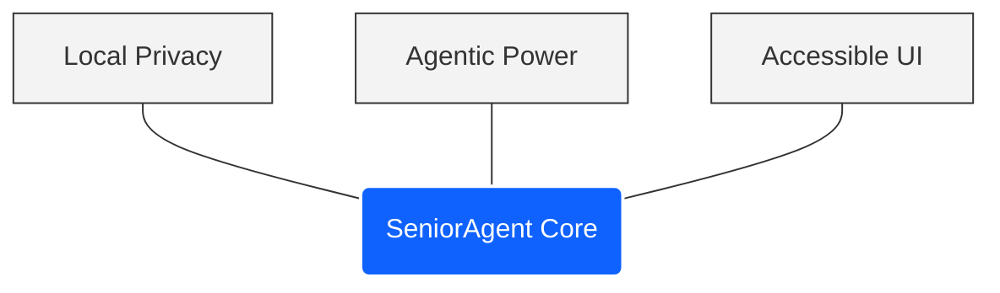

# SeniorAgent Orchestrator: The Local-First Agentic OS

*Bridging the gap between advanced multi-agent workflows and senior accessibility.*

---

## 📽️ Project Presentation
- 📊 **[SeniorAgent Orchestrator Presentation (PPTX)](docs/SeniorAgent_Orchestrator.pptx)**
- 📄 **[SeniorAgent Orchestrator Presentation (PDF)](docs/SeniorAgent_Orchestrator.pdf)**

## 📂 Documentation
All project documentation is organized in the `docs/` directory:
- [AI Guide Integration](docs/AI_GUIDE_INTEGRATION.md)
- [Complete Solution Overview](docs/COMPLETE_SOLUTION.md)
- [File Operations Guide](docs/FILE_OPERATIONS_GUIDE.md)
- [Final Setup Guide](docs/FINAL_SETUP.md)
- [Fixes Applied](docs/FIXES_APPLIED.md)
- [Fix Summary](docs/FIX_SUMMARY.md)
- [Model Update Notes](docs/MODEL_UPDATE.md)
- [Multi-Agent System Details](docs/MULTI_AGENT_SYSTEM.md)
- [Quick Start Guide](docs/QUICK_START.md)
- [Multi-Agent Quick Start Guide](docs/QUICK_START_MULTI_AGENT.md)
- [Readme Gemma4](docs/README_GEMMA4.md)
- [Frontend Sub-project Readme](docs/frontend-README.md)

---

## 🌟 Foundational Pillars

SeniorAgent is engineered at the convergence of three core pillars:



1. **Local Privacy**: 100% local execution. Absolute privacy with zero data leaving the local machine.
2. **Agentic Power**: Autonomous multi-agent workflows running complex tasks locally using LangGraph.
3. **Accessible UI**: High-contrast, premium layouts engineered specifically for older adults without compromising technical depth.

---

## 🛠️ The Local Engine Pipeline

The platform is designed around a three-tier local processing pipeline:

```mermaid
gantt
    title System Startup Pipeline
    dateFormat  X
    axisFormat %s
    
    section The Brain
    Ollama (qwen3.5:9b) :active, 0, 10
    
    section The Backend
    FastAPI (Python 3.10+) :active, 10, 20
    
    section The Frontend
    React / Vite (Node.js) :active, 20, 30
```



1. **The Brain (Port 11434)**: Ollama running `qwen3.5:9b` locally.
2. **The Backend (Port 8000)**: Python 3.10+ and FastAPI handling logic, database mappings, and background task scheduling.
3. **The Frontend (Port 5173)**: Node.js and React/Vite powering the high-contrast user interface.

---

## 📦 Local Setup Instructions

### 1. Model Initialization (Ollama)
Ensure your local Ollama server is running, and pull the default model:
```bash
ollama pull qwen3.5:9b
```

### 2. Backend Initialization
Navigate to the `backend` folder, install the Python package requirements, and start the FastAPI uvicorn server:
```bash
cd backend
pip install -r requirements.txt
python main.py
```
*The backend API will run at `http://localhost:8000`.*

### 3. Frontend Initialization
Navigate to the `frontend` folder, install npm modules, and boot up the Vite dev server:
```bash
cd frontend
npm install
npm run dev
```
*Open your browser and navigate to `http://localhost:5173` to access the interface.*

---

## 🖥️ Detailed Page & Tab Features (9 Core Views)

The application organizes complex technical controls into **9 clean, accessible tabs** styled with an IBM Carbon-inspired color palette (Pure White, Deep Charcoal, Cobalt Blue) and large, scalable typography:

1. **Multi-Agent Hub (Central Chat)**: A single, unified interface for coordinating all multi-agent activity. Automatically routes requests to specialized agents using LangGraph logic.
2. **Agent Teams & Hubs**: Create custom multi-agent teams, pull Ollama models, register Model Context Protocol (MCP) server endpoints, and track real-time token usage.
3. **Workspace Explorer (Visual Directory)**: Inspect, browse, and open code or reports generated by agents directly within whitelisted paths.
4. **Loops & Schedules**: Provision recurring background timers for agents to run tasks periodically without manual intervention (e.g., check product availability every hour).
5. **Agent Arena**: Run identical prompts side-by-side against different agents/models, highlighting latency, TTFT, and output differences.
6. **Performance Stats**: View latency leaderboards measuring Time-to-First-Token (TTFT) and total processing speeds across all calls.
7. **Orchestrator Builder**: Define new agent personas with a simplified wizard (configure Name, Persona Description, System Prompt, and Tool provisioning).
8. **Training Center**: Inject specific Q&A dataset rows to train and fine-tune agents for custom tasks.
9. **Settings & Permissions (Security First)**: Dedicated dashboard to whitelist directories (safe zones) and auto-run configurations for terminal commands.

---

## 🔒 Security First Configurations & Code Control

SeniorAgent features a strict **Safety Sandbox** prioritizing digital safety and user control:

* **File Operations (Read/Write/Repair)**: Agents can autonomously read local files, detect syntax errors, rewrite logic, and write corrected codebases to the filesystem—but *only* inside user-defined "Safe Path" directory whitelists.
* **Terminal Sandboxing**: The Code Agent can run terminal/shell scripts (like running python files or installing npm modules), but every command triggers a permission callout asking the user for authorization (`Allow Execution? [Y/N]`) before execution.
